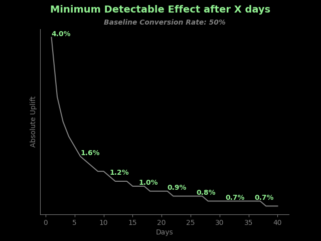

# action-xp-time
> A self-service statistical tool for business  

_**"How long should I run my A/B test?"**_ is asking a CRM Manager.  
I remember how many time this question was resulting in too much inefficient workload for both side. Getting the different specifications from the business to finally run the famous `power.prop.test` function on R to compute either the sample size or the uplift we can detect.

[action-xp-time](https://action-xp-time.streamlit.app/) is an A/B test time duration tool built with [Streamlit](https://streamlit.io/) and hosted on the Community Cloud ([_How to deploy your webapp on Streamlit Community Cloud?_](#how-to-deploy-your-webapp-on-streamlit-community-cloud)). It computes the **Minimum Detectable Effect (MDE)** after X days for a given baseline conversion rate. The MDE is a calculation that estimates the smallest improvement that is statistically significant. It determines how "sensitive" an experiment is. This tool is built for **proportional metrics only** and a 50/50 split between the control and the test group.

# How do I use this tool?

 Go to the sidebar on the left and follow the steps: 
* **Step 1:** fill in the **average daily number of users** entering your experiment (control & test).
* **Step 2:** fill in the **baseline conversion rate** you observed in the past for your specific audience.
* **Step 3:** select **"absolute"** if you want to observe the uplift in percentage points or **"relative"** for in percentage terms.  
  
An example with parameters selected by default:
* Step 1: **5000 users** per day are meeting the requirements of our experiment and can be targeted by our campaign.
* Step 2: We observed in the past for this segment of users that the **conversion rate is equal to 50%**.
* Step 3: We want to observe the difference between the test group conversion rate and the control group conversion rate in percentage points.   
We select **"absolute"**. [_Which is better, absolute or relative display?_](#which-is-better-absolute-or-relative-display)  

# How do I read the results?

You end up with this graph bellow. _What do we see?_  
* **Every 5 days** the MDE value is displayed. In our example case, after 10 days we will be able to detect a significant uplift of 1.2pp.
* Below the graph they are 3 help sentences describing the MDE and the number of users in the experiment **after 7, 14 & 30 days**.

  
  
 * After _7 days_, the control and the test groups are populated by _17500 users each_ and the MDE is equal to 1.5pp (absolute) / 3.0% (relative).
 * After _14 days_, the control and the test groups are populated by _35000 users each_ and the MDE is equal to 1.1pp (absolute) / 2.2% (relative).
 * After _30 days_, the control and the test groups are populated by _75000 users each_ and the MDE is equal to 0.7pp (absolute) / 1.4% (relative).

 # What are the Statistics behind?

The function `power.prop.test` from R is replicated with this formula:  

$n = [Z_{\alpha/2} \sqrt{2p(1-p)} + Z_{\beta} \sqrt{(p_{control}(1-p_{control}) + p_{test}(1-p_{test}))}]^2 / \delta ^2$  

where,  
* n is the **sample size per group**.  
* $\alpha$ is the probability of type I error (significance level): probability of rejecting the true null hypothesis. $\alpha = 5%$.  
* $\beta$ is the probability of type II error (1 - power of the test): probability of failing to reject the false null hypothesis. $1 - \beta = 80%$.  
* Z: The critical value is found by determining the standard normal table area and locating the corresponding value of the row and the column for that area. The standard table is technically a Gaussian table with a mean equivalent to zero and variance equivalent to one. $Z_{alpha/2} = 1.96$.  
* $p = (p_{control} + p_{test}) / 2$  
* $\delta = p_{control} - p_{test}$  

Reference: [Sample Size Calculator: compare two proportions - Casagrande, Pike & Smith](https://www2.ccrb.cuhk.edu.hk/stat/proportion/Casagrande.htm)

 # General Information

## How to deploy your webapp on Streamlit Community Cloud?

You too also played with Streamlit and want to deploy your webapp so the whole world can enjoy your work? Noice.  

Once your file containing all the streamlit UI functions is ready, let's call it `your_name_file.py`, you're good to follow those steps:  
* Create a repository on GitHub for your webapp.  
* Push `your_name_file.py` to your repository. Do not forget to create a `requirements.txt` file with all the required libraries for your project!  
* Create an account on Streamlit. You can link your GitHub account directly.  
* Once your logged in, you have access to "Your apps" space. Click on the right top button "New app".  
* You'll arrived on "Deploy an app" page. Fill in the name of your repository, the branch where `your_name_file.py` is pushed and the file name so `your_name_file.py`. Click on "Deploy" and enjoy!  

Reference: [How to Deploy Your App to Streamlit Community Cloud](https://www.youtube.com/watch?v=HKoOBiAaHGg)

## Which is better, absolute or relative display?

* **Absolute**: What is the difference between the original number and the new one?  
    * Absolute changes on small numbers often look small.  
    * Absolute changes on big numbers often look big.

* **Relative**: By what percentage (larger or smaller) did the number change from the original number?  
    * Relative changes on small numbers often look big.  
    * Relative changes on big numbers often look small.  

Usage recommendation: **your choice!** But, make sure to display the baseline conversion rate too.  
Personaly, I would also recommend to use the relative one when you want to compare experiment results between different segment of users.  

Reference: [Relative vs Absolute Change](https://dataschool.com/misrepresenting-data/relative-vs-absolute-change/)

